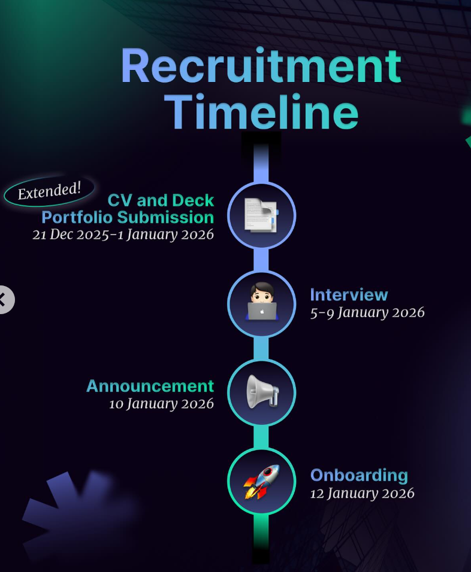

# Rails Workflow

A small Rails app for managing candidate workflows and reviews.

## Key features

- Candidate and stage management
- JWT-based login and API endpoints
- Reviewer roles: assoc, lead, veto
- Workflow policies: configure policy (JSON) that controls whether a decision advances the candidate to the next stage or allows rollback when a "cancelled" quorum is met

## API (examples)

```bash
- POST /api/login
- POST /api/candidate/workflow — submit reviewer decision
- GET  /api/candidate/journey/:candidate_id — workflow journey for a candidate
```

```json
POST /api/candidate/workflow

body:
{
  "phase": "passed",
  "candidate_id": 1,
  "stage_id": 2,
  "feedback": "Good"
}
```

## Quick start

1. Install dependencies: `bundle install`
2. Set env vars: `RAILS_DB_USERNAME`, `RAILS_DB_PASSWORD`, `SECRET_KEY_BASE`
3. DB setup: `rails db:create db:migrate db:seed`
4. Start server: `bin/rails server`

## Tests

- Run all tests: `bin/rails test`
- Run a single file: `bin/rails test test/controllers/candidate_workflow_controller_test.rb`

## License

MIT